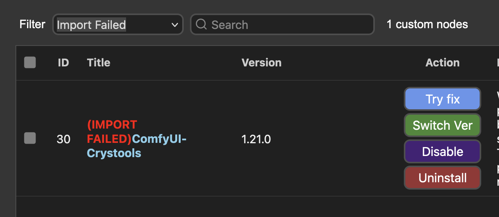

<h1>ComfyUI (NVIDIA) Docker</h1>

**Quick Start**

Make sure you have the NVIDIA Container Toolkit installed. More details: https://blg.gkr.one/20240404-u24_nvidia_docker_podman/

To run the container on an NVIDIA GPU, mount the specified directory, expose only to `localhost` on port `8188` (remove `127.0.0.1` to expose to your subnet, and change the port by altering the `-p local:container` port mapping), pass the calling user's UID and GID to the container, and select the `SECURITY_LEVEL`:

```bash
# 'run' will contain your virtual environment(s), ComfyUI source code, and Hugging Face Hub data
# 'basedir' will contain your custom nodes, input, output, user and models directories
mkdir run basedir


# Using docker
docker run --rm -it --runtime nvidia --gpus all -v `pwd`/run:/comfy/mnt -v `pwd`/basedir:/basedir -e WANTED_UID=`id -u` -e WANTED_GID=`id -g` -e BASE_DIRECTORY=/basedir -e SECURITY_LEVEL=normal -p 127.0.0.1:8188:8188 --name comfyui-nvidia mmartial/comfyui-nvidia-docker:latest

# Using podman
podman run --rm -it --userns=keep-id --device nvidia.com/gpu=all -v `pwd`/run:/comfy/mnt -v `pwd`/basedir:/basedir -e WANTED_UID=`id -u` -e WANTED_GID=`id -g` -e BASE_DIRECTORY=/basedir -e SECURITY_LEVEL=normal -p 127.0.0.1:8188:8188 --name comfyui-nvidia mmartial/comfyui-nvidia-docker:latest
```

<hr>

[ComfyUI](https://github.com/comfyanonymous/ComfyUI/tree/master) is a Stable Diffusion WebUI. 
With the addition in August 2024 of a [Flux example](https://comfyanonymous.github.io/ComfyUI_examples/flux/), I created this container builder to test it. 
This container was built to benefit from the process isolation that containers bring and to drop the container's main process privileges to that of a regular user (the container's `comfy` user, which is `sudo` capable).

The container size (usually over 4GB) contains the required components on an Ubuntu image with Nvidia CUDA and CuDNN (the base container is available from Nvidia's DockerHub); we add the requirements components to support an installation of ComfyUI.

Multiple images are available. Each image's name contains a tag reflecting its core components. For example, `ubuntu24_cuda12.5.1` is based on Ubuntu 24.04 with CUDA 12.5.1. Depending on the version of the Nvidia drivers installed, the Docker container runtime will only support a certain version of CUDA. For example, Driver 550 supports up to CUDA 12.4 and will not be able to run the CUDA 12.4.1 or 12.5.1 versions. The recently released 570 driver supports up to CUDA 12.8 and RTX 50xx GPUs.
Use the `nvidia-smi` command on your system to obtain the `CUDA Version:` entry in the produced table's header.
For more details on driver capabilities and how to update those, please see [Setting up NVIDIA docker & podman (Ubuntu 24.04)](https://blg.gkr.one/20240404-u24_nvidia_docker_podman/).

The `latest` tag will always point to the most up-to-date build (i.e., the most recent OS+CUDA). 
If this version is incompatible with your container runtime, please see the list of alternative builds.

| tag | aka |
| --- | --- |
| ubuntu22_cuda12.3.2-latest | |
| ubuntu22_cuda12.4.1-latest | |
| ubuntu24_cuda12.5.1-latest | latest |

During its first run, the container will download ComfyUI from `git` (into the `run/ComfyUI` folder), create a Python virtual environment (in `run/venv`) for all the Python packages needed by the tool, and install [ComfyUI Manager](https://github.com/ltdrdata/ComfyUI-Manager) into ComfyUI's `custom_nodes` directory. 
This adds about 5GB of content to the installation. The download time depends on your internet connection.

Given that `venv` (Python virtual environments) might not be compatible from OS+CUDA-version to version and will create a new `venv` when the current one is not for the expected version.
**An installation might end up with multiple `venv`-based directories in the `run` folder, as the tool will rename existing unusable ones as "venv-OS+CUDA" (for example, `venv-ubuntu22_cuda12.3.2`). To support downgrading if needed, the script will not delete the previous version, and this is currently left to the end-user to remove if not needed**
Using alternate `venv` means that some installed custom nodes might have an `import failed` error. We are attempting to make use of [`cm-cli`](https://github.com/ltdrdata/ComfyUI-Manager/blob/main/docs/en/cm-cli.md) before starting ComfyUI. If that fails, start the `Manager -> Custom Nodes Manager`, `Filter` by `Import Failed`, and use the `Try fix` button as this will download the required packages and install those in the used `venv`. A `Restart` and UI reload will be required to fix issues with the nodes.

You will know the ComfyUI WebUI is running when you check the `docker logs` and see `To see the GUI go to: http://0.0.0.0:8188`

**About 10GB of space between the container and the virtual environment installation is needed.**
This does not consider the models, additional package installations, or custom nodes that the end user might perform.

**ComfyUI's `security_levels` are not accessible until the configuration file is created during the first run.**

It is recommended that a container monitoring tool be available to watch the logs and see when installations are completed or other relevant messages. Some installations and updates (updating packages, downloading content, etc.) will take a long time, and the lack of updates on the WebUI is not a sign of failure.
[Dozzle](https://github.com/amir20/dozzle) is a good solution for following the logs from a WebUI.


- [1. Preamble](#1-preamble)
- [2. Running the container](#2-running-the-container)
  - [2.1. docker run](#21-docker-run)
  - [2.2. podman](#22-podman)
  - [2.3. Docker compose](#23-docker-compose)
  - [2.4. First time use](#24-first-time-use)
- [3. Docker image](#3-docker-image)
  - [3.1. Building the image](#31-building-the-image)
    - [3.1.1. Using the Makefile](#311-using-the-makefile)
    - [3.1.2. Using a Dockerfile](#312-using-a-dockerfile)
  - [3.2. Availability on DockerHub](#32-availability-on-dockerhub)
  - [3.3. Unraid availability](#33-unraid-availability)
  - [3.4. Nvidia base container](#34-nvidia-base-container)
- [4. Screenshots](#4-screenshots)
  - [4.1. First run: Bottle image](#41-first-run-bottle-image)
  - [4.2. FLUX.1\[dev\] example](#42-flux1dev-example)
- [5. FAQ](#5-faq)
  - [5.1. Virtualenv](#51-virtualenv)
    - [5.1.1. Multiple virtualenv](#511-multiple-virtualenv)
    - [5.1.2. Fixing Failed Custom Nodes](#512-fixing-failed-custom-nodes)
  - [5.2. user\_script.bash](#52-user_scriptbash)
  - [5.3. Available environment variables](#53-available-environment-variables)
    - [5.3.1. WANTED\_UID and WANTED\_GID](#531-wanted_uid-and-wanted_gid)
    - [5.3.2. COMFY\_CMDLINE\_BASE and COMFY\_CMDLINE\_EXTRA](#532-comfy_cmdline_base-and-comfy_cmdline_extra)
    - [5.3.3. BASE\_DIRECTORY](#533-base_directory)
    - [5.3.4. SECURITY\_LEVEL](#534-security_level)
  - [5.4. ComfyUI Manager \& Security levels](#54-comfyui-manager--security-levels)
  - [5.5. Shell within the Docker image](#55-shell-within-the-docker-image)
  - [5.6. Additional FAQ](#56-additional-faq)
- [6. Troubleshooting](#6-troubleshooting)
- [7. Changelog](#7-changelog)

# 1. Preamble

This build is made to NOT run as the `root` user, but run within the container as a `comfy` user using the UID/GID requested at `docker run` time (if none are provided, the container will use `1024`/`1024`).
This is done to allow end users to have local directory structures for all the side data (input, output, temp, user), Hugging Face `HF_HOME` if used, and the entire `models`, which are separate from the container and able to be altered by the user.
To request a different UID/GID at run time, use the `WANTED_UID` and `WANTED_GID` environment variables when calling the container.

Note: 
- for details on how to set up a Docker to support an NVIDIA GPU on an Ubuntu 24.04 system, please see [Setting up NVIDIA docker & podman (Ubuntu 24.04)](https://blg.gkr.one/20240404-u24_nvidia_docker_podman/)
- If you are new to ComfyUI, see [OpenArt's ComfyUI Academy](https://openart.ai/workflows/academy)
- Some ComfyUI examples:
  - [ComfyUI_examples](https://comfyanonymous.github.io/ComfyUI_examples/)
  - [ComfyUI FLUX examples](https://comfyanonymous.github.io/ComfyUI_examples/flux/)
- Some additional reads:
  - [FLUX.1[dev] with ComfyUI and Stability Matrix](https://blg.gkr.one/20240810-flux1dev/)
  - [FLUX.1 LoRA training](https://blg.gkr.one/20240818-flux_lora_training/)

# 2. Running the container

In the directory where we intend to run the container, create the `run` and `basedir` folders as the user with whom we want to share the UID/GID. **This needs to be done before the container is run (it is started as root, so the folders, if they do not exist, will be created as root)** (or give it another name; adapt the `-v` mapping in the `docker run` below). 

That `run` folder will be populated with a few sub-directories created with the UID/GID passed on the command line (see the command line below). 
Among the folders that will be created within `run` are `HF, ComfyUI, venv`
- `HF` is the expected location of the `HF_HOME` (HuggingFace installation directory)
- `ComfyUI` is the git clone version of the tool, with all its sub-directories, among which:
  - `custom_nodes` for additional support nodes, for example, ComfyUI-Manager,
  - `models` and all its sub-directories is where `checkpoints`, `clip`, `loras`, `unet`, etc have to be placed.
  - `input` and `output` are where input images will be placed, and generated images will end up. 
  - `user` is where the user's customizations and saved `workflows` (and ComfyUI Manager's configuration) are stored.
- `venv` is the virtual environment where all the required Python packages for ComfyUI and other additions will be placed. A default ComfyUI package installation requires about 5GB of additional installation in addition to the container itself; those packages will be in this `venv` folder.

**Currently, it is not recommended to volume map folders within the `ComfyUI` folder**. Doing so is likely to prevent proper installation (during the first run) or update, as any volume mapping (`docker ... -v` or `- local_path:container_path` for compose) creates those directories within a directory structure that is not supposed to exist during the initial execution.

The use of the `basedir` is recommended. This folder will be populated at run time with the content from ComfyUI's `input`, `output`, `user` and `models` folders. This allow for the separation of the run time components (within the `run` folder) from the user files. In particular, if you were to delete the `run` folder, you would still have model files in the `basedir` folder.
This is possible because of a new CLI option `--basedir` that was added to the code at the end of January 2025. This option will not be available unless ComfyUI is updated for existing installations.

When starting, the container image executes the `init.bash` script that performs a few operations:
- Ensure we can use the `WANTED_UID` and `WANTED_GID` as the `comfy` user (the user set to run the container),
- Obtain the latest version of ComfyUI from GitHub if not already present in the mounted `run` folder.
- Create the virtual environment (`venv`)  if one does not already exist
  - if one exists, confirm it is the one for this OS+CUDA pair
    - if not, rename it and look for a renamed one that would match
    - if none is found, create a new one
- Activate this virtual environment
- Install all the ComfyUI-required Python packages. If those are already present, additional content should not need to be downloaded.
- Installing ComfyUI-Manager if it is not present.
  - During additional runs, we will allow the user to change the `security_level` from `normal` to another value set using the `SECURITY_LEVEL` environment passed to the container (see the "Security Levels" section of this document for details) to allow for the tool grant more of less functionalities
- Populate the `BASE_DIRECTORY` with the `input`, `output`, `user` and `models` directories from ComfyUI's `run` folder if none are present in the `basedir` folder
  - extend the `COMFY_CMDLINE_EXTRA` environment variable with the `--basedir` option. This variable is `export`ed so that it should be used with any `user_script.bash` if the `BASE_DIRECTORY` is used.
- Check for a user custom script in the "run" directory. It must be named `user_script.bash`. If one exists, run it.
  - **Make sure to use the `COMFY_CMDLINE_EXTRA` environment variable to pass the `--basedir` option to the tool if running the tool from within this script**
- Run the ComfyUI WebUI. For the exact command run, please see the last line of `init.bash`


## 2.1. docker run

To run the container on an NVIDIA GPU, mount the specified directory, expose only to `localhost` on port `8188` (remove `127.0.0.1` to expose to your subnet, and change the port by altering the `-p local:container` port mapping), pass the calling user's UID and GID to the container, provide a `BASE_DIRECTORY` and select the `SECURITY_LEVEL`:

```bash
mkdir run basedir
docker run --rm -it --runtime nvidia --gpus all -v `pwd`/run:/comfy/mnt -v `pwd`/basedir:/basedir -e WANTED_UID=`id -u` -e WANTED_GID=`id -g` -e BASE_DIRECTORY=/basedir -e SECURITY_LEVEL=normal -p 127.0.0.1:8188:8188 --name comfyui-nvidia mmartial/comfyui-nvidia-docker:latest
```

## 2.2. podman

It is also possible to run the tool using `podman`. Before doing so, ensure the Container Device Interface (CDI) is properly set for your driver. Please see https://blg.gkr.one/20240404-u24_nvidia_docker_podman/ for instructions.
To run the container on an NVIDIA GPU, mount the specified directory, expose only to `localhost` on port `8188` (remove `127.0.0.1` to expose to your subnet, and change the port by altering the `-p local:container` port mapping), pass the calling user's UID and GID to the container, provide a `BASE_DIRECTORY` and select the `SECURITY_LEVEL`:

```bash
mkdir run basedir
podman run --rm -it --userns=keep-id --device nvidia.com/gpu=all -v `pwd`/run:/comfy/mnt -v `pwd`/basedir:/basedir -e WANTED_UID=`id -u` -e WANTED_GID=`id -g` -e BASE_DIRECTORY=/basedir -e SECURITY_LEVEL=normal -p 127.0.0.1:8188:8188 --name comfyui-nvidia mmartial/comfyui-nvidia-docker:latest
```

## 2.3. Docker compose

In the directory where you want to run the compose stack, create the `compose.yaml` file with the following content:

```yaml
services:
  comfyui-nvidia:
    image: mmartial/comfyui-nvidia-docker:latest
    container_name: comfyui-nvidia
    ports:
      - 8188:8188
    volumes:
      - ./run:/comfy/mnt
      - ./basedir:/basedir
    restart: unless-stopped
    environment:
      - WANTED_UID=1000
      - WANTED_GID=1000
      - BASE_DIRECTORY=/basedir
      - SECURITY_LEVEL=normal
      - NVIDIA_VISIBLE_DEVICES=all
      - NVIDIA_DRIVER_CAPABILITIES=all
    deploy:
      resources:
        reservations:
          devices:
            - driver: nvidia
              count: all
              capabilities:
                - gpu
                - compute
                - utility
```

This will use port 8188 (`host:container`). Use a `run` directory local to the directory where this `compose.yml` is, and specify the `WANTED_UID` and `WANTED_GID` to 1000 (adapt as needed). Make sure to create the `run` and `basedir` directories as the user with the desired uid and gid before running the docker-compose for the first time.

Start it with `docker compose up` (with `-detached` to run the container in the background)

Please see [docker compose up](https://docs.docker.com/reference/cli/docker/compose/up/) reference manual for additional details.

For users interested in adding it to a [Dockge](https://dockge.kuma.pet/) (a self-hosted Docker Compose stacks management tool ) stack,  please see my [Dockge blog post](https://blg.gkr.one/20240706-dockge/) where we discuss directory and bind mounts (models take a lot of space).

## 2.4. First time use

The first time we run the container, we will go to our host's IP on port 8188 (likely `http://127.0.0.1:8188`) and see the latest run or the bottle-generating example.

Before attempting to run this example, restarting the container is recommended.
The default security model of `normal` is used unless specified, but the needed configuration file is created at the first run of the container. As such, the ComfyUI Manager's default `security_level` can not be modified until the first container restart (after the WebUI ran the first time).

This example requires the [`v1-5-pruned-emaonly.ckpt`](https://huggingface.co/runwayml/stable-diffusion-v1-5/resolve/main/v1-5-pruned-emaonly.ckpt) file which can be downloaded directly from the `Manager`'s "Model Manager".

It is also possible to manually install Stable Diffusion checkpoints, upscale, or Loras (and more) by placing them directly in their respective directories under the `models` folder. For example, to manually install the required "bottle example" checkpoint, as the user with the wanted uid/gid:

```bash
cd <YOUR_BASE_DIRECTORY>/models/checkpoints
wget https://huggingface.co/runwayml/stable-diffusion-v1-5/resolve/main/v1-5-pruned-emaonly.ckpt
```

After the download is complete, click "Refresh" on the WebUI and "Queue Prompt"

Depending on the workflow, some "custom nodes" might be needed. Those should usually be available in the "Manager"'s "Install Missing Custom Nodes".
Other needed files could be found on [HuggingFace](https://huggingface.co/) or [CivitAI](https://civitai.com/).

"Custom nodes" should be installed using the "Manager". The ability to install those manually depends on the `security_levels` selected.

# 3. Docker image

## 3.1. Building the image

### 3.1.1. Using the Makefile


Running `make` will show us the different build targets. That list will differ depending on the available `base` files in the `components` directory

For example, you might see:

Run:
```bash
% make
Available comfyui-nvidia-docker docker images to be built (make targets):
      ubuntu22_cuda12.3.2
      ubuntu22_cuda12.4.1
      ubuntu24_cuda12.5.1

build:          builds all
```

It is possible to build a specific target, such as `make ubuntu22_cuda12.3.2`, or all the available containers.

Running a given target will create a `comfyui-nvidia-docker` `docker buildx`.
As long as none are present, this will initiate a build without caching.

The process will create the `Dockerfile` used within the `Dockerfile` folder. For example, when using `make ubuntu22_cuda12.3.2` a `Dockerfile/Dockerfile-ubuntu22_cuda12.3.2` file is created that will contain the steps used to build the local `comfyui-nvidia-docker:ubuntu22_cuda12.3.2` Docker image.

### 3.1.2. Using a Dockerfile

It is also possible to use one of the generated `Dockerfile` to build a specific image.
After selecting the image to build from the `OS+CUDA` name within the `Dockerfile` folder, proceed with a `docker build` command in the directory where this `README.md` is located.
To build the `ubuntu24_cuda12.5.1` container, run:

```bash
docker build --tag comfyui-nvidia-docker:ubuntu24_cuda12.5.1 -f Dockerfile/Dockerfile-ubuntu24_cuda12.5.1 .
```

Upon completion of the build, we will have a newly created local  `comfyui-nvidia-docker:ubuntu24_cuda12.5.1` Docker image.

## 3.2. Availability on DockerHub

Builds are available on DockerHub at [mmartial/comfyui-nvidia-docker](https://hub.docker.com/r/mmartial/comfyui-nvidia-docker), built from this repository's `Dockerfile`(s).

The table at the top of this document shows the list of available versions on DockerHub. Make sure your NVIDIA container runtime supports the proposed CUDA version. This is particularly important if you use the `latest` tag, as it is expected to refer to the most recent OS+CUDA release.

## 3.3. Unraid availability

The container has been tested on Unraid and [added to Community Apps an 2024-09-02](assets/Unraid_CA-ComfyUI-Nvidia-Docker.png).

FYSA, if interested, you can see the template from https://raw.githubusercontent.com/mmartial/unraid-templates/main/templates/ComfyUI-Nvidia-Docker.xml


## 3.4. Nvidia base container

Note that the original `Dockerfile` `FROM` is from Nvidia, as such:

```
This container image and its contents are governed by the NVIDIA Deep Learning Container License.
By pulling and using the container, you accept the terms and conditions of this license:
https://developer.nvidia.com/ngc/nvidia-deep-learning-container-license
```

# 4. Screenshots

## 4.1. First run: Bottle image


## 4.2. FLUX.1[dev] example

Template at [Flux example](https://comfyanonymous.github.io/ComfyUI_examples/flux/)


# 5. FAQ

## 5.1. Virtualenv

The container pip installs all required packages in the container and then creates a virtual environment (in `/comfy/mnt/venv` with `comfy/mnt` mounted with the `docker run [...]—v`). 

This allows for the installation of Python packages using `pip3 install`. 

After running `docker exec -t comfy-nvidia /bin/bash` from the provided `bash`, activate the `venv` with `source /comfy/mnt/venv/bin/activate`.
From this `bash` prompt, you can now run `pip3 freeze` or other `pip3` commands such as `pip3 install civitai`

### 5.1.1. Multiple virtualenv

Because a `venv` is tied to an OS+CUDA version, the tool attempts to create some internal logic so that the `venv` folder matches the OS+CUDA of the started container.
**Starting two `comfyui-nvidia-docker` containers with different OS+CUDA tags at the same time is likely to cause some issues**

For illustration, let's say we last ran `ubuntu22_cuda12.3.1`, exited the container, and now attempt to run `ubuntu24_cuda12.5.1`. The script initialization is as follows:
- check for an existing `venv`; there is one
- check that this `venv` is for `ubuntu24_cuda12.5.1`: it is not, it is for `ubuntu22_cuda12.3.1`
- move `venv` to `venv-ubuntu22_cuda12.3.1`
- check if there is a `venv-ubuntu24_cuda12.5.1` to renamed as `venv` if present: there is not
- the script continues as if there was no `venv` and a new one for `ubuntu24_cuda12.5.1` is created

Because of this, it is possible to have multiple `venv`-based folders in the "run" folder.

### 5.1.2. Fixing Failed Custom Nodes

A side effect of the multiple virtual environment integration is that some installed custom nodes might have an `import failed` error when switching from one OS+CUDA version to another.
When the container is initialized ,we run `cm-cli.py fix all` to attempt to fix this.
If this does not resolve the issue, start the `Manager -> Custom Nodes Manager`, Filter by `Import Failed`, and use the `Try fix` button. This will download the required packages and install those in the used `venv`. A `Restart` and UI reload will be required, but this ought to fix issues with the nodes.



## 5.2. user_script.bash

The `run/user_script.bash` user script can perform additional operations. 
Because this is a Docker container, updating the container will remove any additional installations not in the "run" directory, so it is possible to force a reinstall at runtime.
It is also possible to bypass the ComfyUI command started (for people interested in trying the `--fast`, for example).

To perform those changes, be aware that:
- The container image is Ubuntu-based.
- The `comfy` user is `sudo` capable.

An example of one could be:

```bash
#!/bin/bash

echo "== Adding system package"
DEBIAN_FRONTEND=noninteractive sudo apt update
DEBIAN_FRONTEND=noninteractive sudo apt install -y nvtop

echo "== Adding python package"
source /comfy/mnt/venv/bin/activate
pip3 install pipx
echo "== Adding nvitop"
# nvitop will be installed in the user's .local/bin directory which will be removed when the container is updated
pipx install nvitop
# extend the path to include the installation directory
export PATH=/comfy/.local/bin:${PATH}
# when starting a new docker exec, will still need to be run as ~/.local/bin/nvitop
# but will be in the PATH for commands run from within this script

echo "== Override ComfyUI launch command"
# Make sure to have 1) activated the venv before running this command 
# 2) use the COMFY_CMDLINE_EXTRA environment variable to pass additional command-line arguments set during the init script
cd /comfy/mnt/ComfyUI
python3 ./main.py --listen 0.0.0.0 --disable-auto-launch --fast ${COMFY_CMDLINE_EXTRA}

echo "== To prevent the regular Comfy command from starting, we 'exit 1'"
echo "   If we had not overridden it, we could simply end with an ok exit: 'exit 0'" 
exit 1
```

The script will be placed in the `run` directory and must be named `user_script.bash` to be found.

If you encounter an error, it is recommended to check the container logs; this script must be executable and readable by the `comfy` user.
If the file is not executable, the tool will attempt to make it executable, but if another user owns it, the step will fail.

## 5.3. Available environment variables

### 5.3.1. WANTED_UID and WANTED_GID

The Linux User ID (`uid`) and Group ID (`gid`) will be used by the `comfy` user within the container.
It is recommended that those be set to the end-user's `uid` and `gid` to allow the addition of files, models, and other content within the `run` directory.
Content to be added within the `run` directory must be created with the `uid` and `gid`.

The running user's `uid` and `gid` can be obtained using `id -u` and `id -g` in a terminal.

### 5.3.2. COMFY_CMDLINE_BASE and COMFY_CMDLINE_EXTRA

You can add extra parameters by adding ComfyUI-compatible command-line arguments to the `COMFY_CMDLINE_EXTRA` environment variable.
For example: `docker run [...] -e COMFY_CMDLINE_EXTRA="--fast --reserve-vram 2.0 --lowvram"`

Note that the `COMFY_CMDLINE_EXTRA` variable might be extended by the init script to match additional parameters such as the `BASE_DIRECTORY` variable.

The default command line used by the script to start ComfyUI is `python3 ./main.py --listen 0.0.0.0 --disable-auto-launch`
This is also the default value set to the `COMFY_CMDLINE_BASE` variable during the initialization script. **It is recommended not to alter the value of this variable, as this might prevent the tool from starting successfully**.

The tool will run the combination of COMFY_CMDLINE_BASE followed by COMFY_CMDLINE_EXTRA. In the above example:
```bash
python3 ./main.py --listen 0.0.0.0 --disable-auto-launch --fast --reserve-vram 2.0 --lowvram
```

In case of container failure, checking the container logs for error messages is recommended.

The tool does not attempt to resolve quotes or special shell characters, so it is recommended that you prefer the `user_script.bash` method.

It is also possible to use the environment variables in combination with the `users_script.bash` by 1) not starting ComfyUI from the script and 2) exiting with `exit 0` (i.e., success), which will allow the rest of the script to continue. The following example installs additional Ubuntu packages and allows for the environment variables to be used:

```bash
#!/bin/bash

#echo "== Update installed packages"
DEBIAN_FRONTEND=noninteractive sudo apt-get update
DEBIAN_FRONTEND=noninteractive sudo apt-get upgrade -y

# Exit with an "okay" status to allow the init script to run the regular ComfyUI command
exit 0
```

Note that `pip install`ation of custom nodes is not possible in `normal` security level, and `weak` should be used instead (see the "Security levels" section for details)

### 5.3.3. BASE_DIRECTORY

The `BASE_DIRECTORY` environment variable is used to specify the directory where ComfyUI will look for the `models`, `input`, `output`, `user` and `custom_nodes` folders.

**This option was added to ComfyUI at the end of January 2025. If you are using an already existing installation, update ComfyUI using the manager before enabling this option.** 

Once enabled, this option should not be disabled in future run.
During the first run with this option, the tool will **move** exisiting content from the `run` directory to the `BASE_DIRECTORY` specified.
This is to avoid having multiple copies of downloaded models (taking multiple GB of storage) in both locations.
**If your `models` directory is large, I recommend doing a manual `mv run/ComfyUI/models basedir/.` before running the container. The volumes are considered separate within the container, so the move operation within the container will 1) perform a file copy for each file within the folder (which will take a while) 2) double the model directory size before it is finished copying before it can delete the previous folder.**
The same logic can be applied to the `input`, `output`, `user`, and `custom_nodes` folders.

### 5.3.4. SECURITY_LEVEL

After the initial run, the `SECURITY_LEVEL` environment variable can be used to alter the default security level imposed by ComfyUI Manager.

When following the rules defined at https://github.com/ltdrdata/ComfyUI-Manager?tab=readme-ov-file#security-policy the user should decide if `normal` will work for their use case. 
You will prefer ' weak ' if you manually install or alter custom nodes.
**WARNING: Using `normal-` will prevent access to the WebUI.**

## 5.4. ComfyUI Manager & Security levels

[ComfyUI Manager](https://github.com/ltdrdata/ComfyUI-Manager/) is installed and available in the container.

The container is accessible on `0.0.0.0` internally to the container (i.e., all network interfaces), but it is only accessible on the exposed port outside of the running container.

To modify the `security_level`:
- manually: by going into your "run" folder directory and editing either `ComfyUI/user/default/ComfyUI-Manager/config.ini` if present, otherwise `custom_nodes/ComfyUI-Manager/config.ini` and alter the `security_level = ` to match your requirements (then reload ComfyUI)
- automatically: use the `SECURITY_LEVEL` docker environment variable at run time to set it for this run.

Note that if this is the first time starting the container, the file will not yet exist; it is created the first time ComfyUI is run. After this step, stop and restart the container; the `config.ini` will be there at consecutive restarts

To use `cm-cli`, from the virtualenv, use: `python3 /comfy/mnt/custom_nodes/ComfyUI-Manager/cm-cli.py`.
For example: `python3 /comfy/mnt/custom_nodes/ComfyUI-Manager/cm-cli.py show installed` (`COMFYUI_PATH=/ComfyUI` should be set)

## 5.5. Shell within the Docker image

Depending on your `WANTED_UID` and `WANTED_GID`, when starting a `docker exec` (or getting a `bash` terminal from `docker compose`), it is possible that the shell is started with incorrect permissions (we will see a `bash: /comfy/.bashrc: Permission denied` error). The `comfy` user is `sudo`-able: run `sudo su comfytoo` to get the proper UID/GID.


## 5.6. Additional FAQ

See [extras/FAQ.md] for additional FAQ topics, among which:
- Updating ComfyUI
- Updating ComfyUI-Manager
- Installing a custom node from git

# 6. Troubleshooting

The `venv` in the "run" directory contains all the Python packages the tool requires.
In case of an issue, it is recommended that you terminate the container, delete (or rename) the `venv` directory, and restart the container. 
The virtual environment will be recreated; any `custom_scripts` should re-install their requirements; please see the "Fixing Failed Custom Nodes" section for additional details.

It is also possible to rename the entire "run" directory to get a clean installation of ComfyUI and its virtual environment. This method is preferred, compared to deleting the "run" directory—as it will allow us to copy the content of the various downloaded `ComfyUI/models`, `ComfyUI/custom_nodes`, generated `ComfyUI/outputs`, `ComfyUI/user`, added `ComfyUI/inputs`, and other folders present within the old "run" directory.
If using the `BASE_DIRECTORY` environment variable, please note that some of that `run` directory content will be moved to the `BASE_DIRECTORY` specified.

If using the `BASE_DIRECTORY` option and the program exit saying the `--base-directory` option does not exist, this is due to an outdated ComfyUI installation. A possible solution is to disable the opton, restart the container and use the ComfyUI-Manager to update ComfyUI. Another option is manually update the code: `cd run/ComfyUI; git pull`

# 7. Changelog

- 20250202: Added `BASE_DIRECTORY` variable
- 20250116: Happy 2nd Birthday ComfyUI -- added multiple builds for different base Ubuntu OS and CUDA combinations + added `ffmpeg`  into the base container.
- 20250109: Integrated `SECURITY_LEVELS` within the docker arguments + added `libGL` into the base container.
- 20240915: Added `COMFY_CMDLINE_BASE` and `COMFY_CMDLINE_EXTRA` variable
- 20240824: Tag 0.2: shift to pull at first run-time, user upgradable with lighter base container
- 20240824: Tag 0.1: builds were based on ComfyUI release, not user upgradable
- 20240810: Initial Release